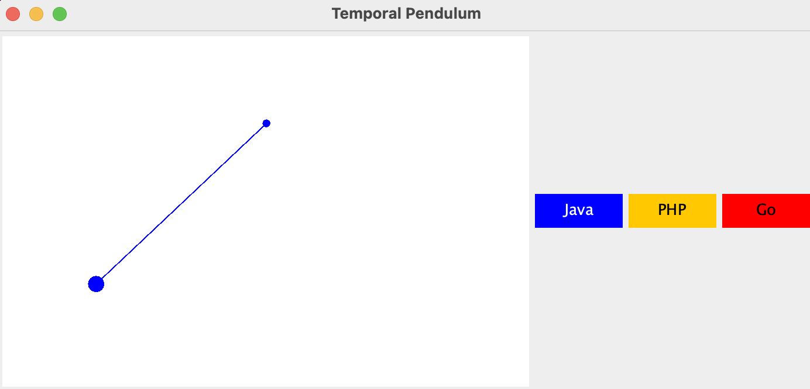

### Temporal Polyglot Demo - Pendulum


<p align="center">

</p>

This demo uses the following Temporal SDKs:
* [Java](https://docs.temporal.io/docs/java/introduction)
* [Go](https://docs.temporal.io/docs/go/introduction)
* [PHP](https://docs.temporal.io/docs/php/introduction)


### Running the demo

#### Start the Temporal Server:
```shell script
git clone https://github.com/temporalio/docker-compose.git
cd  docker-compose
docker compose up
```

#### Start the positioning services

##### Java Ppositioning Service

```shell script
cd position-java
mvn compile exec:java -Dexec.mainClass="io.temporal.demo.pendulum.Pendulum"
```

##### PHP Positioning Service

```shell script
cd position-php
./rr serve
```

##### Go Positioning Service

```shell script
cd position-go
go run worker/main.go
```

#### Start the game

```shell script
cd game
mvn compile exec:java -Dexec.mainClass="io.temporal.demo.pendulum.Pendulum"
```

#### Playing the game

Withing the game you can change the positioning implementations
by clicking on the buttons on the right.

Notice how the state of the pendulum (position, acceleration, movement)
is preserved once you switch from one workflow to another.